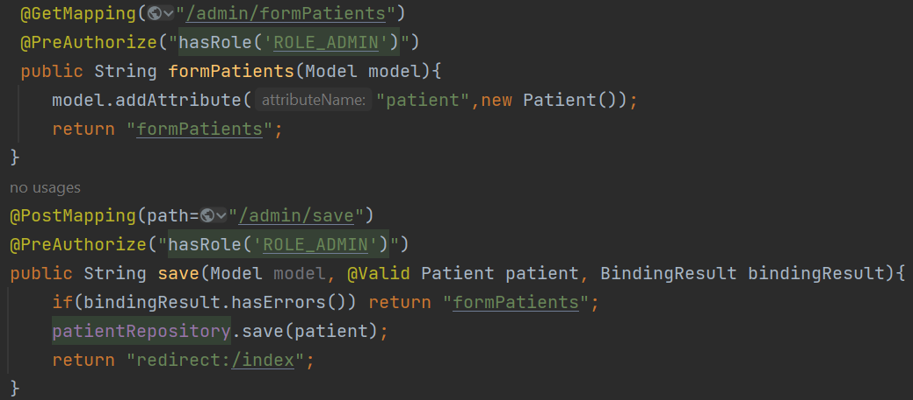

<h2>Spring MVC et Spring security</h2>
<h5>Une application Web JEE basée sur Spring MVC Thylemeaf, Spring Security et Spring Data JPA qui permet de gérer les patients.</h5>
<h6>L'arborescence du projet</h6>

<h6>L'entité Patient avec les annotations Jpa et les annotations Lombok</h6>

<h6>Controller (PatientController)</h6>
<li>Chercher les patients</li>

<li>Supprimer un patient</li>

<li>Afficher le formulaire de saisie</li>
<li>Enregistrer un patient</li>

<h6>Les vues basés sur Thymeleaf</h6>

<h5>La partie sécurité</h5>
<h6>L'ajout d'un système d'authentification basé sur Spring security </h6>
<li>Classe de configuration</li>

<li> Security Controller</li>

<li>La page web</li>

